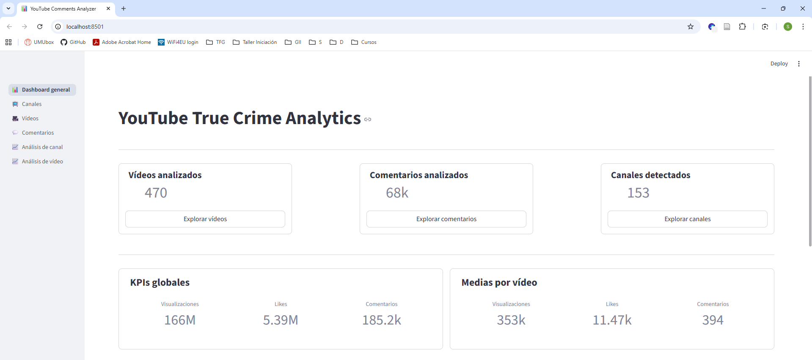
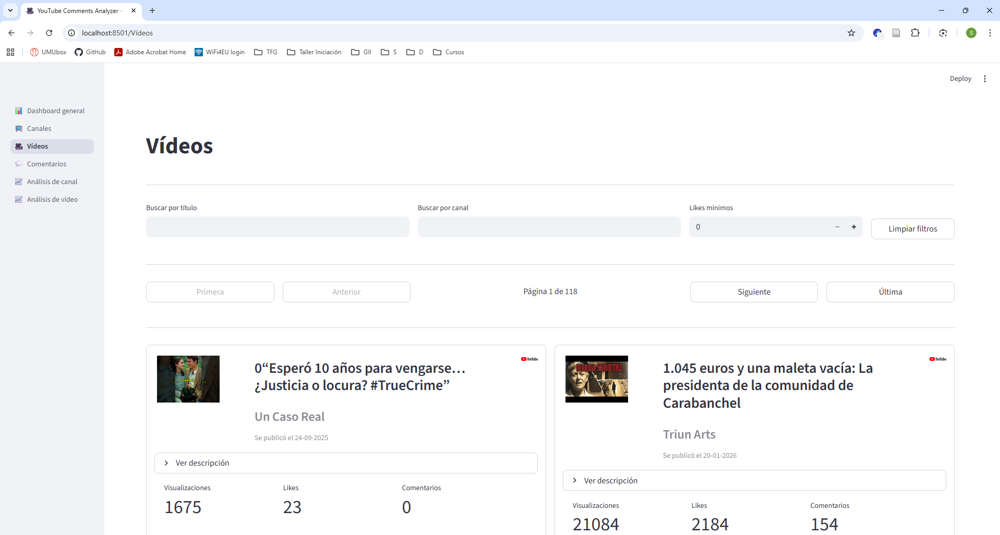
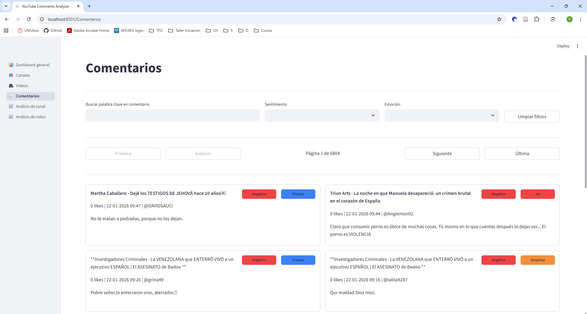
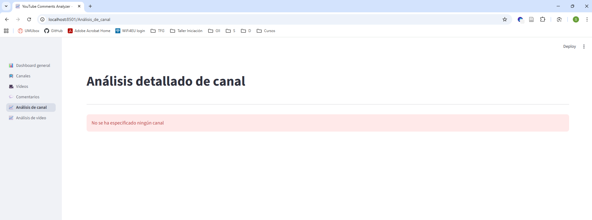
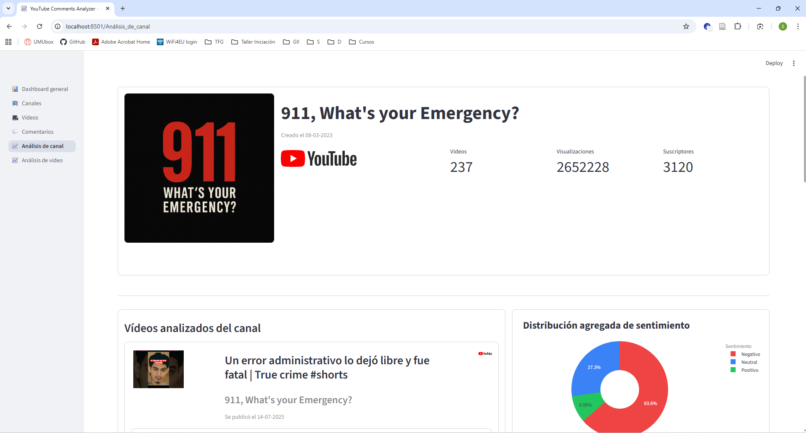
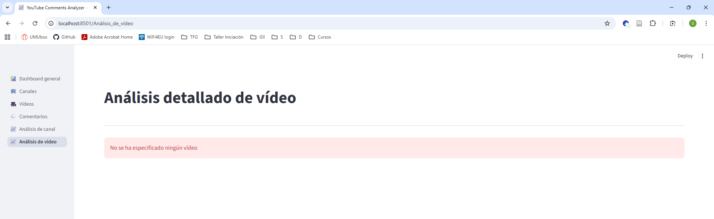
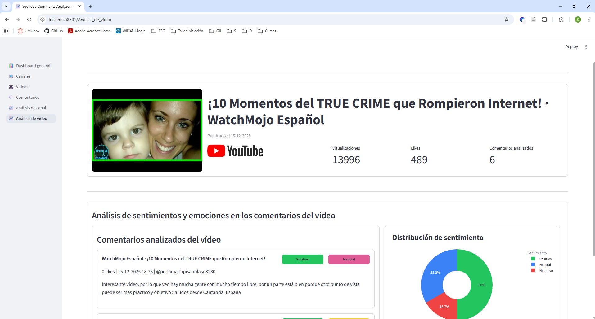

# YouTube Comments Analyzer

Proyecto para la **recopilación, análisis y visualización de métricas de canales y vídeos de YouTube sobre True Crime español**, incluyendo **análisis de sentimientos y emociones de comentarios de los propios vídeos**.

---

## Descripción general

El sistema extrae información detallada de canales, vídeos y comentarios desde la **API de YouTube**. La almacena en una base de datos **PostgreSQL** y aplica modelos de **PLN** para analizar sentimientos y emociones en los comentarios. Finalmente, se muestra los resultados en un **dashboard interactivo** creado con Streamlit.

---

## Tecnologías utilizadas

- **Python** 3.10+
- **PostgreSQL**
- **SQLAlchemy**
- **Docker** y **Docker Compose**
- **Streamlit**
- **Git**

---

## Arquitectura general

- **Base de datos (PostgreSQL)** \
  Almacena los datos y expone vistas SQL optimizadas para la visualización.

- **Back-end (Python)** \
  Gestiona la ingesta de datos (mediante un **crawler**), inicializa la base de datos y realiza el análisis de comentarios mediante modelos PLN.

- **Front-end (Streamlit)** \
  Permite la visualización de métricas, gráficos y KPIs.

---

## Estructura del proyecto

```
youtube-comments-analyzer/        # Carpeta raíz del proyecto
│
├── assets/
|   └── images/
|       └── views/                # Imágenes utilizadas en este documento
|  
├── back-end/
│   ├── docker-compose.yml         # Servicios Docker (PostgreSQL)
│   ├── src/
│   │   ├── analysis/              # Modelos de PLN
│   │   ├── config/                # Configuración de BD y variables de entorno
│   │   ├── models/                # Modelos SQLAlchemy
│   │   ├── repositories/          # Acceso a datos (Repositorios)
│   │   ├── services/              
│   │   ├── tests/                 # Tests funcionales
│   │   ├── views/                 # Vistas SQL consumidas por el front-end
│   │   └── workers/               # Crawler y analizador de comentarios
│   ├── main.py                    # Inicialización de la BD (creación de tablas y vistas)
│   └── .env.template              # Plantilla de variables de entorno
│
├── front-end/
│   ├── cards/                     # Tarjetas reutilizables (canal, vídeo y comentario)
│   ├── components/                # Filtros y paginación
│   ├── db/                        # Consultas a vistas SQL
│   ├── pages/                     # Páginas de la app
│   ├── plots/                     # Gráficos Plotly reutilizables
│   ├── services/                   
│   ├── utils/
│   ├── 01_📊_Dashboard_general.py  # App front-end en Streamlit
│   └── .env.template              # Plantilla de variables de entorno 
│
└── README.md
```
---

## Requisitos previos

- Git
- Docker y Docker Compose
- Python 3.10+
- (Opcional) Entorno virtual con `venv` o `conda`

--- 

## Instalación y configuración del entorno

### 1. Clonar el repositorio

#### Ubuntu / macOS

```bash
git clone https://github.com/sararoca/youtube-comments-analyzer.git
cd youtube-comments-analyzer
```

#### Windows (PowerShell)
```powershell
git clone https://github.com/sararoca/youtube-comments-analyzer.git
cd youtube-comments-analyzer
```

---

### 2. Crear archivo de entorno

#### Ubuntu / macOS

```bash
cd back-end
cp env.template .env
```

#### Windows

```powershell
cd back-end
Copy-Item env.template .env
```

IMPORTANTE: Una vez que se ha creado el archivo .env, hay que abrirlo y rellenarlo con nuestras variables de entorno.

---

### 3. Levantar la base de datos (PostgreSQL)

#### Ubuntu / macOS

```bash
docker compose up -d
```

#### Windows (PowerShell)

```powershell
docker compose up -d
```

---

### 4. Inicialización de la base de datos

Se va a trabajar con entornos virtuales, pero esto es opcional. Una vez que ya se tiene levantada la base de datos, se crea el entorno virtual, se entra en él, se instalan las dependencias (puede llevar algo de tiempo) y se lanza el script de inicialización de la BD (*main.py*).

Este script:

- Crea las tablas con SQLAlchemy
- Ejecuta el archivo *views.sql*
- Deja la BD lista para consultas analíticas

#### Ubuntu / macOS

```bash
python -m venv venv
source venv/bin/activate
pip install -r requirements.txt
python src/main.py
```

#### Windows

```powershell
Set-ExecutionPolicy -Scope Process -ExecutionPolicy Bypass
python -m venv venv
.\venv\Scripts\Activate.ps1
pip install -r requirements.txt
python src/main.py
```

---

## Ingesta y análisis de datos

### 1. Lanzar el crawler para recopilar datos

Dentro del entorno virtual y en la carpeta de *back-end*, vamos a lanzar el crawler con el script *youtube_crawler.py* ubicado en la carpeta *workers*. La primera vez que este se lanza puede tardar algo de tiempo, puesto que está configurado para que guarde hasta 500 vídeos y hasta 1000 comentarios por vídeo.

Este script:

- Recupera los datos de la API de YouTube
- Almacena los datos en la BD
  
#### Ubuntu / macOS

```bash
python src/workers/youtube_crawler.py
```

#### Windows

```powershell
python src/workers/youtube_crawler.py
```

---


### 2. Lanzar el analizador de comentarios

Una vez recopilados todos los datos en la BD, dentro del entorno virtual y en la carpeta de *back-end*, vamos a lanzar el analizador de comentarios con el script *comments_analyzer.py* ubicado en la carpeta *workers*. La primera vez que este se lanza puede tardar tiempo, ya que puede haber una cantidad considerable de comentarios por analizar.

Este script:

- Recupera los comentarios que no han sido analizados
- Analiza los comentarios para detectar emociones
- Analiza los comentarios para detectar sentimientos
- Almacena los nuevos datos de emociín y sentimiento en la BD
- Actualiza los comentarios en la BD para que ya no aparezcan como NO analizados


#### Ubuntu / macOS

```bash
python src/workers/comments_analyzer.py
```

#### Windows

```powershell
python src/workers/comments_analyzer.py
```

---

### 3. Cerrar el entorno virtual

#### Ubuntu / macOS

```bash
deactivate
```

#### Windows

```powershell
deactivate
```

IMPORTANTE: Una vez que ya se ha acabado con las funcionalidades del *back-end*, se recomienda cerrar el entorno virtual con el que se estaba trabajando.

---

## Visualización (Streamlit)

### 1. Crear archivo de entorno

Con el entorno virtual anterior cerrado:

#### Ubuntu / macOS

```bash
cd ../front-end
cp env.template .env
```

#### Windows

```powershell
cd ..\front-end
Copy-Item env.template .env
```

IMPORTANTE: Una vez que se ha creado el archivo .env, hay que abrirlo y rellenarlo con nuestras variables de entorno.

---

### 2. Visualizar el dashboard interactivo

Se va a trabajar con entornos virtuales, pero esto es opcional. Se crea el entorno virtual, se entra en él, se instalan las dependencias (puede llevar algo de tiempo) y se lanza la aplicación (*01_📊_Dashboard_general.py*).

#### Ubuntu / macOS

```bash
python -m venv venv
source venv/bin/activate
pip install -r requirements.txt
streamlit run 01_📊_Dashboard_general.py
```

#### Windows

```powershell
Set-ExecutionPolicy -Scope Process -ExecutionPolicy Bypass
python -m venv venv
.\venv\Scripts\Activate.ps1
pip install -r requirements.txt
streamlit run .\01_📊_Dashboard_general.py
```


IMPORTANTE: La aplicación quedará accesible por defecto en: **http://localhost:8501**.

---


## Funcionalidades del dashboard

- KPIs de canales y vídeos
- Evolución temporal de métricas
- Análisis de emociones y sentimientos
- Filtros por canal, vídeo y métricas

--- 

## Vistas del dashboard interactivo

### Dashboard general

Pantalla de inicio del dashboard que muestra un resumen general con KPIs globales, medias por vídeo, gráficos de emoción y sentimiento agregados, nubes de palabras y comentarios destacados por *likes*.

<p align="center">
  
</p>

<p align="center">
  
</p>

### Canales

Listado de los canales analizados, se puede acceder desde la barra lateral o desde la opción *Explorar canales* que aparece en la pantalla principal del dashboard. Permite filtrar canales por visualizaciones y por suscriptores. Si se hace clic en la foto del canal, se accederá a su vista detallada.

<p align="center">
  
</p>

### Vídeos

Listado de los vídeos analizados, se puede acceder desde la barra lateral o desde la opción *Explorar vídeos* que aparece en la pantalla principal del dashboard. Permite filtrar vídeos por *likes*. Si se hace clic en la foto del vídeo, se accederá a su vista detallada.

<p align="center">
  
</p>

### Comentarios

Listado de los comentarios analizados, se puede acceder desde la barra lateral o desde la opción *Explorar comentarios* que aparece en la pantalla principal del dashboard. Permite filtrar comentarios por sentimiento y emoción.

<p align="center">
  
</p>

### Análisis de canal

Si se accede sin haber indicado un canal nos lo aclarará. 
<p align="center">
  
</p>

Si se llega a esta vista desde el listado de canales, se mostrará el análisis detallado del canal. Se mostrará un listado de los vídeos de ese canal analizados y gráficos con información sobre el canal. También se puede indicar el canal introduciendo su ID en la URL (http://localhost:8501/Análisis_de_canal?idChannel=135).

<p align="center">
  
</p>

### 🔍 Análisis de vídeo

Si se accede sin haber indicado un vídeo nos lo aclarará. 
<p align="center">
  
</p>

Si se llega a esta vista desde el listado de vídeos, se mostrará el análisis detallado del vídeo. Se mostrará un listado de los comentarios de ese vídeo analizados y gráficos con información sobre el vídeo. También se puede indicar el vídeo introduciendo su ID en la URL (http://localhost:8501/Análisis_de_vídeo?idVideo=156).

<p align="center">
  
</p>

---